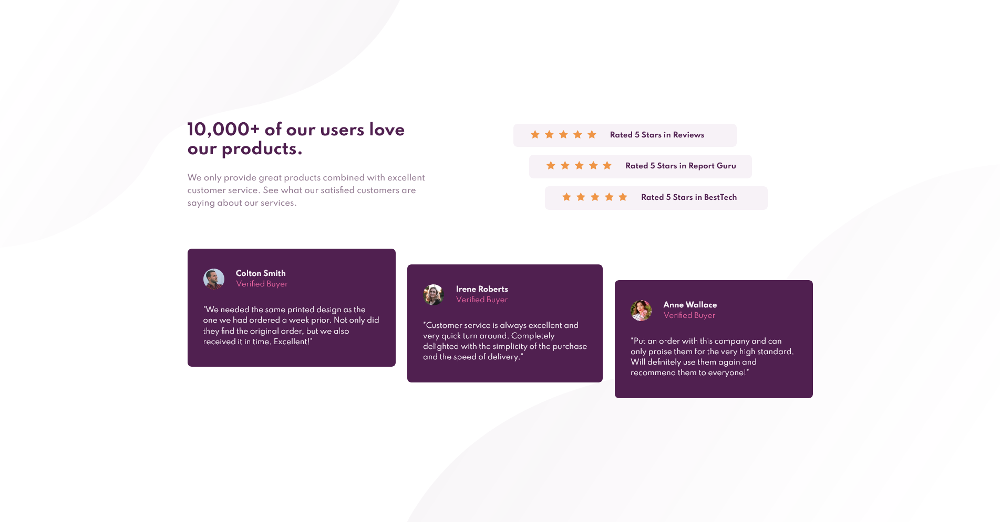
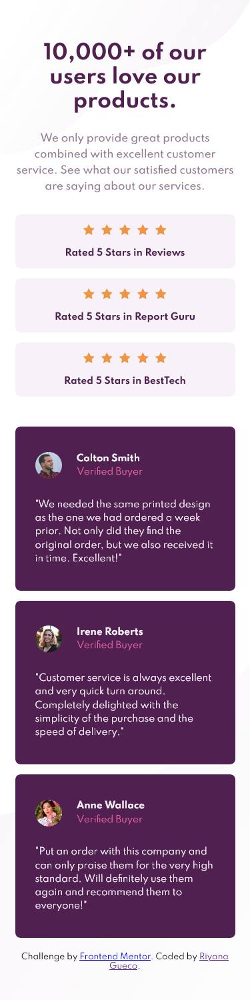

# Frontend Mentor - Social proof section solution

This is a solution to the [Social proof section challenge on Frontend Mentor](https://www.frontendmentor.io/challenges/social-proof-section-6e0qTv_bA). Frontend Mentor challenges help you improve your coding skills by building realistic projects. 

## Table of contents

- [Overview](#overview)
  - [The challenge](#the-challenge)
  - [Screenshot](#screenshot)
  - [Links](#links)
- [My process](#my-process)
  - [Built with](#built-with)
  - [What I learned](#what-i-learned)
  - [Useful resources](#useful-resources)
- [Author](#author)

## Overview

### The challenge

Users should be able to:

- View the optimal layout for the section depending on their device's screen size

### Screenshot

#### Desktop View

####

### Links

- Solution URL: [https://www.frontendmentor.io/solutions/social-proof-section-using-semantic-html-and-sass-YAd4GR_vJ](https://www.frontendmentor.io/solutions/social-proof-section-using-semantic-html-and-sass-YAd4GR_vJ)
- Live Site URL: [https://rngueco.github.io/social-proof-section](https://rngueco.github.io/social-proof-section/)

## My process

### Built with

- Semantic HTML5 markup
- Flexbox
- Mobile-first workflow
- [Sass](https://sass-lang.com/)

### What I learned

It's my first time working with Sass. Most of my time was spent reading the documentation to see if I can do things differently than I normally do with pure CSS. My selectors ended up a bit more specific than I like, but I think it's okay.

I can definitely see the advantages of using Sass and I look forward to using more of it in future projects.

### Useful resources

- [Sass Documentation](https://sass-lang.com/documentation)

## Author

- Frontend Mentor - [@rngueco](https://www.frontendmentor.io/profile/rngueco)
- Twitter - [@RiyanaGueco](https://www.twitter.com/RiyanaGueco)